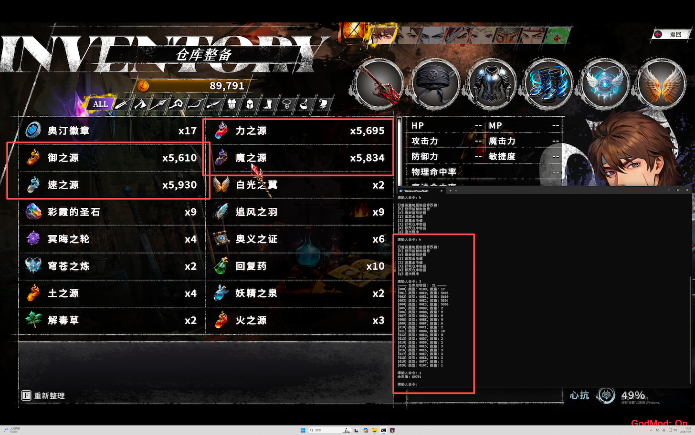

# 幻世录重制版修改器

经典版中的 `-godset` 启动参数在重制版依然是可用的。在 GodMod 模式下挑战高难度还是会有些困难，因此写了一个简单的修改器。

## 使用方法

1. 首先安装 python3 运行环境( https://python.org/ )(经过测试 python3.10，windows 11 可以使用。)
2. 执行命令 python src/cli.py 启动修改器
3. 根据提示修改物品

### 注意事项

- 在修改之前做好存档，若是修改出错，可以重新加载存档；
- 当前只能修改金钱跟仓库的物品，人物属性（攻击、防御等）在每次战斗结束后，所有的修改都会重置，因此没有实现该功能；可以通过另外的思路来实现：修改出大量的 力之源、御之源、魔之源、速之源，然后给人物使用，这样属性的提升就是永久的了；
- 可以将仓库中已有的物品，修改为其他物品及数量，但是不能新增物品。例如，可以将仓库中第3个位置的“御之源”修改为其他的物品；
- 修改出的装备无法直接给人物装备使用，这时需要先存档保存当前的修改内容，然后再读档，这样才能使用修改后的装备；
- 时间仓促，做得不是很完善，修改物品时需要输入物品对应的代码；以下是一些常见的物品代码(16进制)：
  - B9 白光之翼 (全)行动二次
  - BA 幸运缎带 (全)经验2倍
  - BB 彩霞的圣石 (全)免疫全部异常状态
  - BC 黄金的圣杯 (全)金钱2倍
  - BD 追风之羽 (全)移动距离+1
  - BE 冥晦之轮 (全)移动后可使用魔法
  - BF 奥义之证 (全)攻击距离+1
  - C0 火红水晶 (全)抗火+32%
  - C1 穹苍之炼 (剑弓祭法翼魔剑)移动距离+1 攻击距离+1 移动后可使用魔法 职业限制：祭师、剑士、魔法师、翼战士、魔剑士
  - 010C 神秘小礼物 神秘商人赠送的小礼物，听说是99999号客人才能获得的极稀有奖品
  - 010D 奥汀徽章 一枚神秘徽章，其由来的古老与神秘，甚至连那位流浪商人也一无所知，唯一的线索便是其表面镌刻的一行古代符文，隐约显现着“致未来的你”
  - E0 力之源
  - E1 御之源
  - E2 魔之源
  - E3 速之源
  - E4 土之源
  - E5 火之源
  - E6 水之源
  - E7 风之源
  - E8 灵之源
  - E9 会心之素
  - EA 铁壁之素
  - ED 通行证
  - EF 剑之魂
  - F0 福音之书
  - F1 圣水晶
  - F8 染血的披风 <转职道具>染血的披风
  - F9 法兰克的日志 <转职道具>法兰克的日志
  - FC 擎的戒指 <转职道具>擎的戒指
  - FD 仿制的破坏神内核 <转职道具>仿制的破坏神内核
  - FE 漆黑的羽毛 <转职道具>漆黑的羽毛
  - 100 妖精王的手札 <转职道具>妖精王的手札
